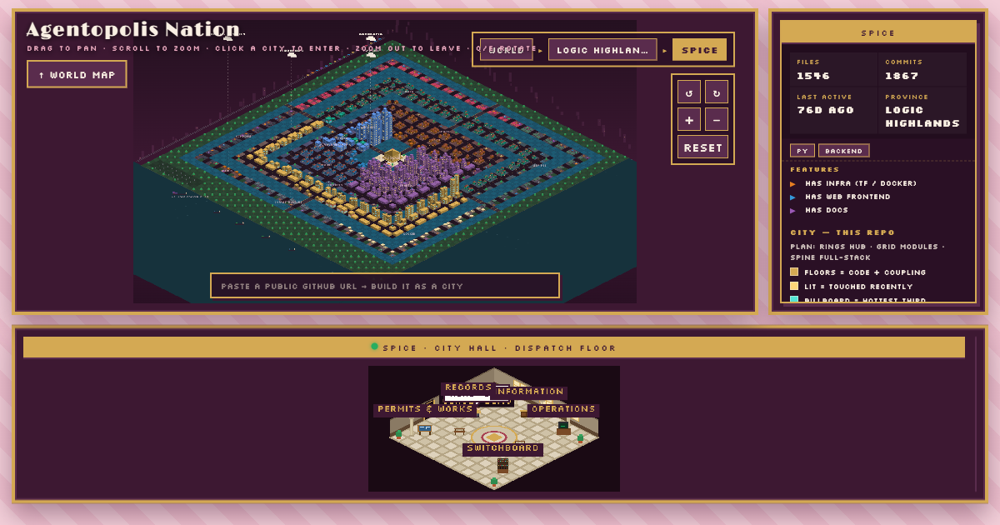

<div align="center">



# Agentopolis

**Turn any repo into a living isometric city — watch Claude Code agents build it brick by pixel brick in real time, or rewind its entire git history into a time-lapse movie.**

[](https://pypi.org/project/agentopolis/)
[](https://pypi.org/project/agentopolis/)
[](https://pypi.org/project/agentopolis/)
[](LICENSE)

[**Live demo**](https://agentopolis.codeblackwell.ai) · [Install](#install) · [The two views](#the-two-views) · [Modes](#modes) · [How it works](#how-it-works)

</div>

---

Your repo, but make it a tiny pixel metropolis. Agentopolis turns a git
repository into a Habbo-style isometric city and runs two scenes at once, on one
page:

- **The skyline** *is* your codebase — seeded from git history, zoned by
  architecture. Files are buildings, and the city grows taller every time your
  agents ship.
- **The dispatch floor** below is City Hall, where every Claude Code agent is a
  little pixel worker clocking in, hustling between stations, and getting things
  done.

All hand-drawn pixel art on a plain canvas (no Habbo assets were harmed),
zero-config, and the live view never so much as taps Claude Code on the shoulder
— it stays completely off the critical path.

### Two ways to use it

- **🖥️ A live "screensaver" for your coding sessions.** Park `agentopolis .` on
  a spare monitor and your codebase turns into a city you watch get built in real
  time — workers scurry between stations as agents run tools, scaffolding snaps
  around the file you're editing, and every `git commit` cuts the scaffold loose
  and raises a fresh floor. It's oddly hypnotic, and a glanceable read on exactly
  what your agents are up to right now.
- **🎬 A ridiculously fun way to show off a repo.**
  `agentopolis movie https://github.com/owner/repo` fast-forwards *any* public
  repo's entire git history into a growing-city time-lapse — no clone, no setup,
  no fuss. Share it as a clean link or an autoplaying embed and it unfurls with a
  shiny skyline card. Perfect for a README hero, a launch-day flex, or settling
  the "this project came a long way" argument once and for all.

## Contents

- [Install](#install)
- [Quickstart](#quickstart)
- [Usage recipes](#usage-recipes)
  - [As a live screensaver of your agents](#-as-a-live-screensaver-of-your-agents)
  - [As a fun way to share a repo](#-as-a-fun-way-to-share-a-repo)
- [The two views](#the-two-views)
  - [The skyline — your codebase as a city](#-the-skyline--your-codebase-as-a-city)
  - [The dispatch floor — agents at work](#-the-dispatch-floor--agents-at-work)
- [Modes](#modes)
  - [Live hooks](#live-hooks)
  - [Movie mode](#movie-mode)
  - [Crawl & marathon](#crawl--marathon)
- [Sharing & embedding](#sharing--embedding)
- [Onboarding tour](#onboarding-tour)
- [Zoning](#zoning)
- [How it works](#how-it-works)
- [Development](#development)
- [Known limits](#known-limits)
- [License](#license)

## Install

```bash
uv tool install agentopolis        # or: pipx install agentopolis
                                   # or: brew install codeblackwell/tap/agentopolis
```

Needs Python 3.11+ and travels light — FastAPI and uvicorn are the only runtime
dependencies.

## Quickstart

```bash
cd ~/code/any-repo

agentopolis .                      # live: hooks attached, city on :4242, hooks removed on exit
agentopolis movie                  # replay this repo's git history as a growing city
agentopolis movie ../other-repo    # …or any local repo
agentopolis movie https://github.com/owner/repo   # …or any public github repo
agentopolis crawl ~/code           # rank a folder of repos by movie potential
agentopolis marathon ~/code        # play every repo's movie back-to-back
```

Open <http://localhost:4242>, fire up any Claude Code session, and watch it stroll
in and report for duty — no extra wiring. Leave the tab open on a spare monitor
and you've got a live screensaver of your agents at work. No session handy?
<http://localhost:4242/?demo> plays a scripted day in the city so you can see the
whole show.

## Usage recipes

### 🖥️ As a live screensaver of your agents

Run it right in the repo you're hacking on. The one-shot form clips the hooks on
when it starts and tidies them away when you quit — fire-and-forget, nothing to
clean up:

```bash
cd ~/code/my-project
agentopolis .                  # serve on :4242, hooks attached for this run only
```

Pin <http://localhost:4242> on a second monitor and code with Claude Code like
you always do — every session (and every subagent it spawns) wanders in on its
own. Workers bustle across the dispatch floor as tools run, scaffolding hugs the
file being edited, and each `git commit` drops the scaffold and raises new floors.

Want the city open for business across every session and project? Attach the
hooks once and just serve whenever the mood strikes:

```bash
agentopolis attach             # write hooks into ~/.claude/settings.json (a backup is saved)
agentopolis                    # serve the live city; sessions keep reporting in
agentopolis detach             # remove the hooks when you're done
```

Babysitting a whole workspace at once? Spread every repo under a folder across a
world map as a **nation** of cities:

```bash
agentopolis --root ~/code      # one map, one city per repo
```

### 🎬 As a fun way to share a repo

Rewind any repo's git history and watch the city sprout in fast-forward. Aim it
at a public GitHub URL (no clone — it sips just enough git data, all in memory)
or a local path:

```bash
agentopolis movie https://github.com/owner/repo   # any public repo
agentopolis movie ~/code/my-project               # …or your own, local
agentopolis movie                                 # …or the current repo
```

When the movie rolls, smash **Share** to grab a clean link, fling it to socials,
or download the build clip. Heads up: links from a *local* run point at
`localhost` (great for you, useless for everyone else), so to share with the
world open the same repo on the hosted instance — or your own deployed one:

```text
# Canonical link — unfurls with a generated skyline card:
https://agentopolis.codeblackwell.ai/c/owner/repo

# Chromeless autoplaying embed for a README or blog post:
<iframe src="https://agentopolis.codeblackwell.ai/player/owner/repo"
        width="800" height="450" frameborder="0" allowfullscreen></iframe>
```

Can't decide which repo is the blockbuster? Let Agentopolis scout the talent,
then screen the whole lineup back-to-back:

```bash
agentopolis crawl ~/code           # score every repo by movie potential
agentopolis marathon ~/code        # auto-advancing reel, best first
agentopolis marathon ~/code --top 5
```

## The two views

### 🏙️ The skyline — your codebase as a city

The city *is* the repo. A zoning manifest maps globs to components and layers
(or Agentopolis just eyeballs your top-level directories and zones it for you),
then every building is sculpted straight from the code:

| Encoding | Maps to |
|---|---|
| **Floors** | cross-component centrality (how much depends on it) |
| **Footprint** | lines of code |
| **Window glow** | recency — recently-touched files light up |
| **Building shape** | language family — pyramids for scripting, glass drums for web, ziggurats for compiled |
| **Tethered clouds** | managed services, floating above the city |

(Bored of shapes-by-language? Flip them to key off rarity / size / age instead.)
As agents work, the city builds itself: edits throw up scaffolding, a `git commit`
yanks the scaffolds down and stacks on floors, and brand-new files pop into
existence as brand-new buildings. The map quietly re-seeds from git every time
HEAD moves. Grab the full-screen explorer at `/` and pan, zoom, and gawk to your
heart's content.

### 🛎️ The dispatch floor — agents at work

Every agent is a pixel worker with somewhere to be. Your main session checks in
at reception, subagents stroll through the door the moment they're spawned, and
each tool call sends a worker marching off to the right station:

| Station | Tools |
|---|---|
| CRT terminal | `Bash` |
| Archive shelf | `Read`, `Grep`, `Glob` |
| Workshop | `Edit`, `Write` |
| Telephone booth | web tools |

A pulsing gold aura means a session is twiddling its thumbs waiting on you (a
permission prompt or just idle). Hover any guest to see who they are and what
they're busy with.

## Modes

| Command | What it does |
|---|---|
| `agentopolis` / `agentopolis attach` | Serve the live city; attach hooks once so every new Claude Code session reports in |
| `agentopolis .` | Zero-setup one-shot — attach hooks on start, serve, remove them on exit (Ctrl+C) |
| `agentopolis movie [target]` | Replay a repo's git history as a city that grows and re-forms commit by commit |
| `agentopolis crawl <folder>` | Rank every repo in a folder by movie potential (formation ladder, history length, deletions) |
| `agentopolis marathon <folder>` | Grab every repo's movie and play them best-first in one auto-advancing reel |
| `agentopolis --root <folder>` | Map every git repo under a folder as a **nation** of cities on a world map |

### Live hooks

`agentopolis .` is the lazy genius path — it clips the Claude
Code hooks on at startup and whisks them away when you quit, and it's polite
enough to leave a prior manual `agentopolis attach` alone. Want the hooks to
stick around? `agentopolis attach` wires them once (and stashes a backup of
`settings.json` first), `agentopolis` then just serves, and `agentopolis detach`
pulls them back out.

### Movie mode

`target` is a local repo dir or a public github url. GitHub
repos download only the bare-minimum git data (a `blob:none` clone that gets
shredded the instant seeding is done) and the city lives entirely in memory. Run
it outside a git repo and Agentopolis won't sulk with a blank map — it'll kindly
point you at one instead.

### Crawl & marathon

Both run fully local and offline, and cache per repo+HEAD so the
encore is instant. `--top N` trims a marathon playlist to the headliners; `--json`
spits crawl results out as JSON.

## Sharing & embedding

Building a city from a repo's history is half the fun — showing it off is the
other half. Clean canonical links and a chromeless autoplaying player make a city
trivial to drop into a README, a group chat, or a launch post:

- `…/c/owner/repo` — canonical movie link (equivalent to `?forge=github.com/owner/repo`)
- `…/player/owner/repo` — chromeless autoplaying movie for iframe embeds and player cards

Shared links unfurl with a generated social card showing the captured skyline.
The in-app **Share** button (top-right of any city) builds these links for you
and also offers a downloadable clip — see the
[sharing recipe](#-as-a-fun-way-to-share-a-repo) for the exact URLs and an embed
snippet.

## Onboarding tour

First visit? A guided tour spotlights every part of the interface, narrated by a
hand-drawn pixel **Chief of Staff** who is, frankly, thrilled you're here. It
auto-runs once per view (shared movie/forge links included), and the "?" handle
beneath the camera controls summons it back anytime. See
[docs/tour.md](docs/tour.md).

## Zoning

Drop an `.agentopolis.json` manifest in the repo to play city planner — it defines
the components, layers, and floating clouds (see
[`city/example.json`](city/example.json) for the full blueprint). Skip it and
Agentopolis happily zones the place itself from your top-level directories. Point
at a custom manifest with `--zone`.

The rest of the knobs: `--repo` (which repo to map, default cwd), `--port`
(default 4242), `--no-open` (skip the browser pop), `--showcase` (serve baked
nation fixtures with no live git).

## How it works

```
Claude Code hooks ──curl──▶ POST /hook ──▶ normalize ──SSE──▶ canvas renderer
```

No magic, just plumbing:

- **`hooks.py`** registers a `curl -m 1 … || true` on eight hook events
  (SessionStart, UserPromptSubmit, Notification, Pre/PostToolUse, Stop,
  SubagentStop, SessionEnd). It never blocks Claude Code — if the city's asleep,
  the curl shrugs, times out, and moves on.
- **`server.py`** (FastAPI) slims each payload down to `{event, session, tool, detail}`
  (plus `agent_id` / `agent_type` for events fired inside subagents), remembers the
  last 100 events, and broadcasts them over SSE — so latecomers still get the recap.
- **`static/`** paints the room, the city, and the citizens on a plain canvas. The
  skyline is seeded from git (`seed.py`) and re-seeds itself whenever HEAD moves.

## Development

Want to tinker under the hood? The `justfile` has you covered:

```bash
just dev               # nation for the parent workspace on :4242 (hot reload)
just town ../some-repo # serve one repo as a city on :4243
just movie ../some-repo # time-lapse a repo's history on :4244
just test              # backend functional + Playwright UI suite (81 tests)
```

First Playwright run, grab a browser: `uv run --extra test playwright install chromium`.

Releases are tag-driven — `just release X.Y.Z` bumps the version, tags, and
pushes, then CI takes the wheel: publish to PyPI, update the Homebrew tap, and
redeploy the hosted demo while you go get coffee.

## Known limits

- Citizens only face forward for now — no directional sprites yet, so everyone's a
  bit of a poser.

## License

[MIT](LICENSE) © LeChristopher Blackwell
